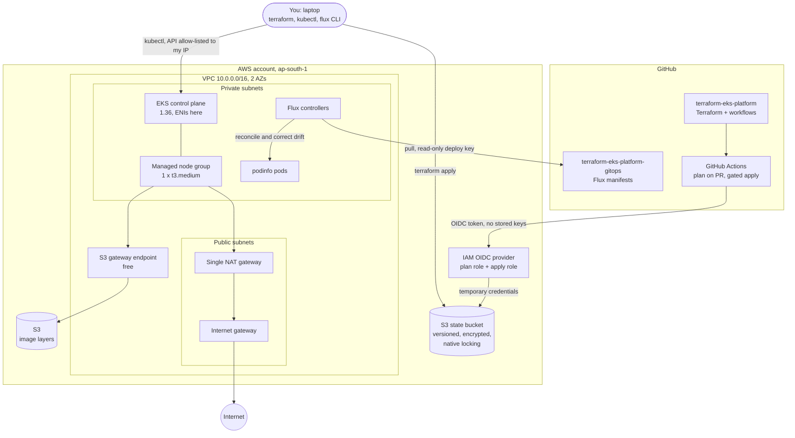

# terraform-eks-platform

[](https://github.com/siddharthtp10/terraform-eks-platform/actions/workflows/terraform-pr.yml)

A small, production-style Terraform platform on AWS that is cheap enough to **create for an afternoon and destroy
afterwards**: S3 remote state with native locking, a VPC, an EKS cluster on managed nodes with IRSA and access
entries, GitHub Actions CI/CD that authenticates with OIDC (no stored AWS keys) and fails on high-severity
security findings, and Flux GitOps delivering a public sample app. Every file explains *why*, not just what, and
[docs/interview-notes.md](docs/interview-notes.md) turns each design choice into interview questions.

## Architecture



**How to read it.** Terraform state lives in S3 and survives every teardown. Nodes sit in private subnets and reach the
internet only through one NAT gateway, while S3 traffic (container image layers) bypasses the NAT through a free gateway
endpoint. CI assumes an IAM role through GitHub OIDC for the duration of a job. Flux runs inside the cluster and *pulls*
from Git, so no CI system holds cluster credentials.

## Repository layout

| Path | Purpose |
|------|---------|
| `bootstrap/` | One-off config (local state) that creates the S3 state bucket. It outlives the platform. |
| `envs/dev/` | The platform: VPC (`vpc.tf`), EKS (`eks.tf`), providers and variables. Remote state in S3. |
| `ci-access/` | One-off config: GitHub OIDC provider and least-privilege plan/apply IAM roles for CI. |
| `gitops/` | Content of the separate GitOps repository Flux watches: `clusters/`, `infrastructure/`, `apps/`. |
| `.github/workflows/` | PR checks + read-only plan (`terraform-pr.yml`); manual, approval-gated apply (`terraform-apply.yml`). |
| `docs/` | [Interview notes](docs/interview-notes.md), [CI setup](docs/ci-setup.md), [GitOps setup](docs/gitops-setup.md). |

There is no local `modules/` directory on purpose: the community VPC and EKS modules cover everything needed.

## Prerequisites

- An AWS account and a local login that can create IAM, VPC, EKS and KMS resources (SSO profile or IAM user).
- **Terraform 1.10 or newer** (needed for S3-native state locking; CI uses 1.16.5), AWS CLI v2, `kubectl`.
- [Flux CLI](https://fluxcd.io/flux/installation/) 2.9 or newer (supports Kubernetes 1.36).
- `git`, [pre-commit](https://pre-commit.com), [tflint](https://github.com/terraform-linters/tflint).
- A GitHub account. The CI and Flux steps also need your own copy of this repo and a second, empty repo for GitOps.

Nothing secret is ever committed. Account IDs, ARNs, your IP and the bucket name live in gitignored `terraform.tfvars` /
`backend.hcl` files (templates: `*.example`) or GitHub Actions secrets.

## Deploy, step by step

All commands are run by you. Nothing in this repo applies itself.

```bash
git clone https://github.com/<OWNER>/terraform-eks-platform && cd terraform-eks-platform
pre-commit install && tflint --init
aws sts get-caller-identity            # confirm you are in the right account
```

**1. State bucket (once, local state)**

```bash
cd bootstrap
cp terraform.tfvars.example terraform.tfvars    # set a globally unique state_bucket_name
terraform init && terraform plan -out=tfplan && terraform apply tfplan
terraform output
```

**2. Platform (VPC + EKS, about 15 minutes)**

```bash
cd ../envs/dev
cp backend.hcl.example backend.hcl              # bucket name from step 1
cp terraform.tfvars.example terraform.tfvars    # admin_principal_arn, api_allowed_cidrs (your IP/32)
terraform init -backend-config=backend.hcl
terraform plan -out=tfplan                      # review: about 58 resources, no destroys
terraform apply tfplan
$(terraform output -raw update_kubeconfig_command)
kubectl get nodes && kubectl get pods -A        # node Ready, system pods Running
```

**3. GitOps (Flux)**: follow [docs/gitops-setup.md](docs/gitops-setup.md). The GitHub token is passed only through an
environment variable at run time.

**4. CI/CD (optional)**: follow [docs/ci-setup.md](docs/ci-setup.md) (OIDC roles, secrets, protected environment,
branch ruleset).

## Cost

Estimates for **ap-south-1**, USD, running 24 hours a day. Prices come from public AWS pricing information gathered in
October 2026 and change over time: always confirm on the AWS pricing pages before relying on them
([EKS](https://aws.amazon.com/eks/pricing/), [EC2](https://aws.amazon.com/ec2/pricing/on-demand/),
[VPC / NAT gateway and public IPv4](https://aws.amazon.com/vpc/pricing/)).

| Item | Price | Per hour |
|---|---|---|
| EKS control plane (standard-support Kubernetes version) | $0.10 / hour | **$0.100** |
| 1 x `t3.medium` node, On-Demand Linux | $0.0448 / hour | **$0.045** |
| NAT gateway (exists = billed, even idle) | $0.056 / hour | **$0.056** |
| Public IPv4 address for the NAT gateway | $0.005 / hour | **$0.005** |
| KMS key (secrets encryption), node EBS volume | about $1 / month; a few cents / month | under $0.005 |
| **Total while the platform is up** | | **about $0.21 per hour** |

- **A 4-hour session is about $0.85**, or roughly **$1** once you add the ~30 minutes it takes to create and destroy.
- Data processed by the NAT gateway costs about $0.056 per GB; the S3 endpoint keeps image pulls off it, so a demo adds cents.
- The state bucket holds a few kilobytes: pennies per month.
- **Forgetting to destroy costs about $150 per month** (0.21 x 730 hours). Always destroy (next section).
- Extended-support Kubernetes versions cost $0.60/hour for the control plane instead of $0.10.


## Destroy, in the correct order

Order matters: things created *by* Kubernetes (load balancers, EBS volumes) are not in Terraform state. If the cluster
is destroyed first they are orphaned, keep billing, and block VPC deletion. And the state bucket must go **last**,
because the other stacks' state is stored in it.

```bash
# 1. Flux and the apps (stop Flux recreating things, prune what it deployed)
flux suspend kustomization flux-system
flux delete kustomization apps --silent
flux delete kustomization infrastructure --silent
flux uninstall --silent

# 2. The platform: cluster, node, NAT, VPC (the expensive part)
cd envs/dev && terraform destroy

# 3. CI access (optional; do it before the bucket, its state lives there)
cd ../../ci-access && terraform destroy

# 4. Finally the state bucket, only when you are done with the project for good
```

`bootstrap/` is protected on purpose (`prevent_destroy = true`, `force_destroy = false`). To remove it, deliberately edit
`bootstrap/main.tf`: delete the `lifecycle { prevent_destroy = true }` block and set `force_destroy = true`, run
`terraform apply` (applies the flag), then `terraform destroy` in `bootstrap/`. Revert the edit if you keep the repo.

Afterwards confirm nothing is left billing: `aws eks list-clusters`, `aws ec2 describe-nat-gateways` and the Cost
Explorer, filtered by the `Project=terraform-eks-platform` tag.

## Design decisions and trade-offs

| Decision | Why | Trade-off / what changes in production |
|---|---|---|
| Separate `bootstrap/`, local state | The state bucket can't store its own state, and must outlive the destroyed platform. | If bootstrap state is lost you re-import the bucket. |
| S3 native locking (`use_lockfile`), no DynamoDB | One less resource to build, secure and pay for (Terraform 1.10+). | Requires Terraform 1.10+. |
| Partial backend config (`backend.hcl`) | Bucket name not hard-coded in a public repo; same code works for any bucket/env. | One more file to create locally. |
| SSE-S3 (not KMS) on the state bucket | Free and simple for a demo. | Production: customer-managed KMS key for audit and key control (Trivy flags this; suppressed with a reason and an expiry). |
| Community VPC and EKS modules, exact version pins | Tested building blocks; modules have no lock file, so exact pins give reproducibility. | Upgrades are deliberate PRs. |
| One NAT gateway | Halves fixed cost for a demo. | A single AZ failure loses egress for all private subnets. Production: one NAT per AZ (`single_nat_gateway = false`). |
| Nodes in private subnets, public API restricted to my IP | No public node IPs; laptop access without a VPN. | Production: fully private endpoint reached via VPN/bastion/SSM. |
| EKS access entries (`authentication_mode = "API"`) | Auditable, Terraform-managed access; no hand-edited `aws-auth` ConfigMap. | Principal ARNs must be exact (SSO role paths). |
| IRSA (hand-written role for the EBS CSI driver) | Shows the OIDC/trust-policy mechanics explicitly. | EKS Pod Identity is simpler across many clusters. |
| `t3.medium`, not `t3.small` | `t3.small` caps at 11 pods (ENI limits); kube-system plus Flux would not fit. | Production: size to workload; consider Karpenter or EKS Auto Mode. |
| Two CI roles (read-only plan, scoped apply) | A pull request can never write; apply is reachable only from the protected environment. | More IAM to maintain. |
| Apply is manual and approval-gated | An EKS stack bills hourly; a README typo must not start the meter. | A real team auto-applies cheap stacks (see the comment in `terraform-apply.yml`). |
| Actions pinned to commit SHAs | Tags can be re-pointed by an attacker; SHAs cannot. | Needs Dependabot/Renovate to stay current. |
| GitOps content in a separate repo | Flux must write to its branch; this repo's `main` is protected. | Two repos to keep in sync. |
| Flux (pull) over CI `kubectl apply` (push) | No cluster credentials in CI; drift is corrected automatically. | Another component to operate; sync delay. |

## Security notes

- **No long-lived credentials anywhere.** CI uses OIDC; the Flux bootstrap token is read from an environment variable once and
  is not stored in the cluster (Flux keeps a read-only SSH deploy key). `.gitignore` excludes state, `*.tfvars`, `backend.hcl`,
  kubeconfigs and keys; pre-commit rejects private keys; the repo was scanned with gitleaks (full history) and Trivy.
- **State is sensitive.** It can hold secrets in plaintext, so the bucket is versioned, encrypted, blocks all public access,
  denies non-TLS requests and is never destroyed by accident.
- **Least privilege for CI.** The trust policies pin both repo and context (`pull_request` vs the protected environment). The
  apply role is scoped by resource name, region and an allow-list of attachable managed policies. It is *scoped, not perfect*:
  the comments in `ci-access/permissions.tf` list where to tighten further.
- **Public repo hygiene.** PR plan comments are redacted (account IDs, IPs), the binary plan is never uploaded as an artifact, and
  fork PRs get no secrets or OIDC token.
- **Cluster hardening.** Secrets encrypted with a KMS key; nodes private; the API allow-list rejects `0.0.0.0/0`; the sample app
  namespace enforces the `restricted` Pod Security profile and the manifests pass the same HIGH/CRITICAL Trivy gate as the Terraform.
- **Scanner gate.** Trivy fails the PR on HIGH/CRITICAL findings. Accepted risks are suppressed in code with a justification and an
  expiry, never by weakening the gate.

## What I would do differently in production

- A fully private API endpoint, with access through a VPN or SSM, and one NAT gateway per AZ (or VPC endpoints plus no NAT).
- Customer-managed KMS keys for state and secrets; S3 access logging and replication for the state bucket.
- Separate AWS accounts per environment (and for state/CI), with the apply role limited further by permissions boundaries and resource-tag conditions.
- Karpenter or EKS Auto Mode for node scaling, multiple node groups/AZs, pinned add-on versions and a documented upgrade path.
- Secrets via External Secrets Operator (AWS Secrets Manager) or SOPS with KMS; admission policy (Kyverno/OPA); network policies.
- Observability: control-plane logs, metrics, alerting, and flow logs on when needed (they are off here for cost).
- Dependabot/Renovate for actions, modules and images; image digest pinning and signature verification; scheduled drift detection (`plan` on a timer).
- Promotion between environments with PRs (dev, staging, prod overlays) instead of a single `dev`.

## What I learned

_(To be written by the repo owner: three or four honest sentences about what surprised you, what broke, and what you would
explain differently now. Interviewers read this section.)_

## License

[MIT](LICENSE)
